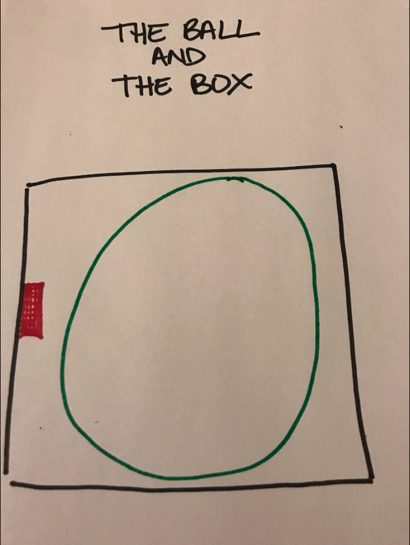
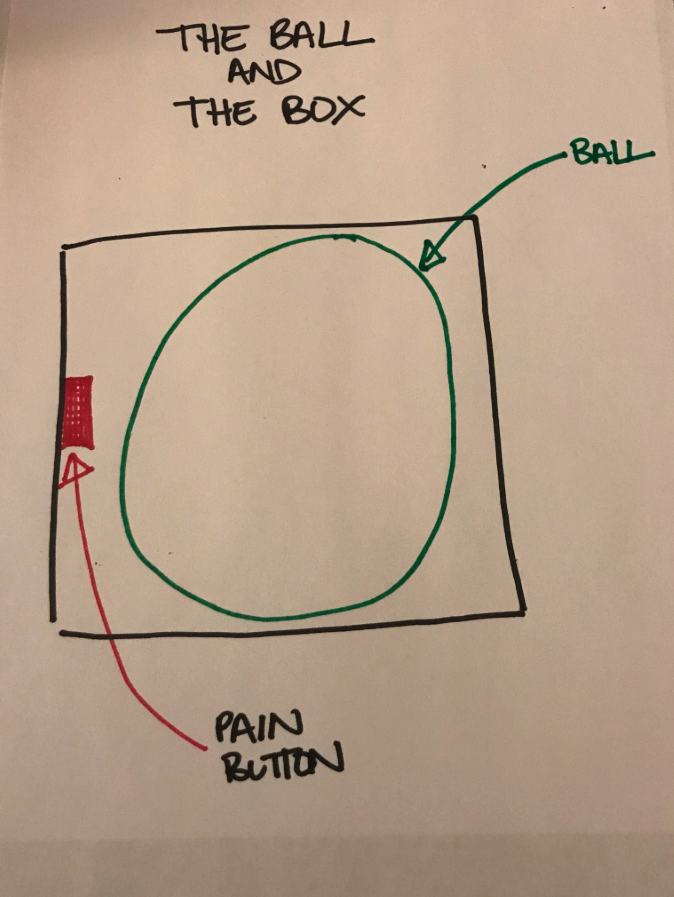
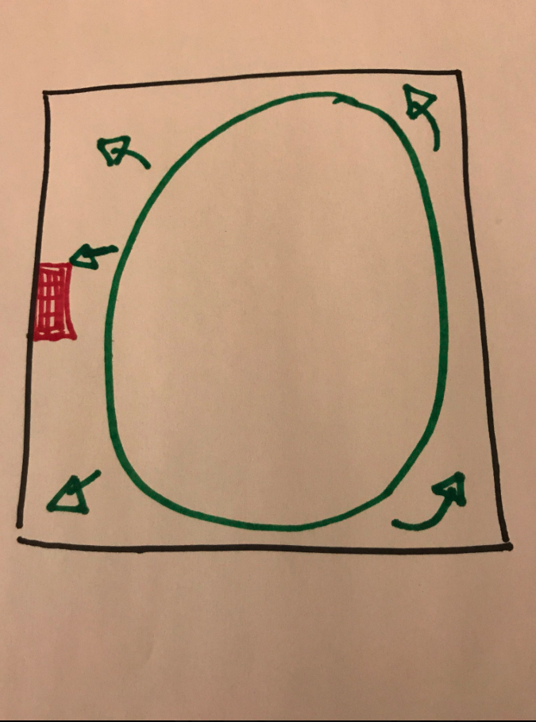
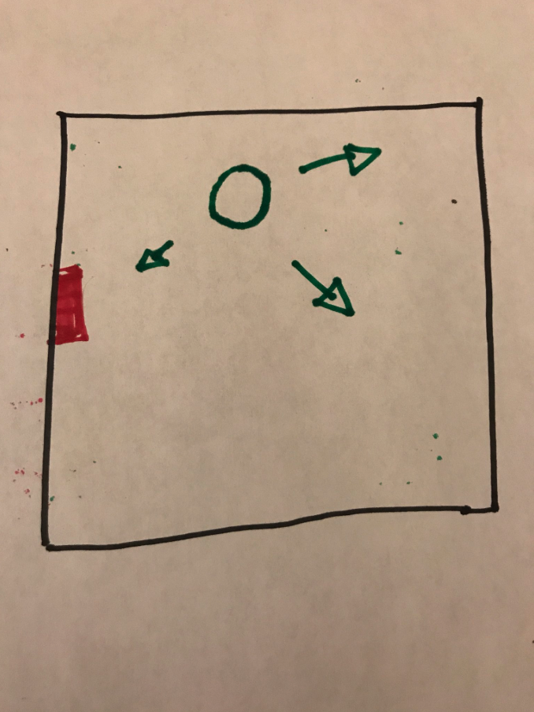
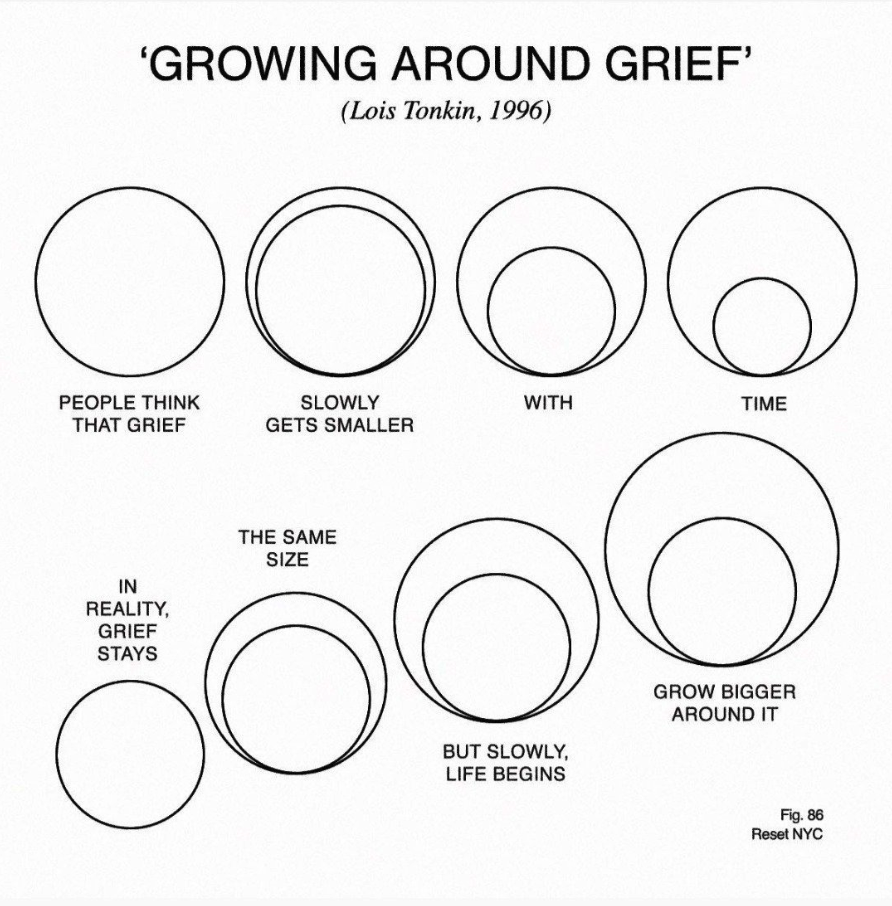

A curated collection of the best things I've come across on grief.

---

### 1. Lauren Herschel: The Ball in the Box

This is hands down the best thing I've seen written about grief.

Grief is like this: there's a box with a ball in it. And a pain button.

In the beginning, the ball is huge. You can't move the box without the ball hitting the pain button. It rattles around on its own in there and hits the button over and over. You can't control it, it just keeps hurting. Sometimes it seems unrelenting.

Over time, the ball gets smaller. It hits the button less and less, but when it does, it hurts just as much. You can function day to day more easily, but the ball randomly hits that button when you least expect it.

For most people, the ball never really goes away. It might hit less and less, and you have more time to recover between hits, unlike when the ball was still giant.

*"The ball was really big today. It wouldn't lay off the button. I hope it gets smaller soon."*

**Source:**

<blockquote class="twitter-tweet" data-conversation="none"></blockquote>

---

### 2. GSnow: The Waves

A response to "My friend just died. I don't know what to do."

> Alright, here goes. I'm old. What that means is that I've survived (so far) and a lot of people I've known and loved did not. I've lost friends, best friends, acquaintances, co-workers, grandparents, mom, relatives, teachers, mentors, students, neighbors, and a host of other folks. I have no children, and I can't imagine the pain it must be to lose a child. But here's my two cents.
>
> I wish I could say you get used to people dying. I never did. I don't want to. It tears a hole through me whenever somebody I love dies, no matter the circumstances. But I don't want it to "not matter". I don't want it to be something that just passes. My scars are a testament to the love and the relationship that I had for and with that person. And if the scar is deep, so was the love. So be it. Scars are a testament to life. Scars are a testament that I can love deeply and live deeply and be cut, or even gouged, and that I can heal and continue to live and continue to love. And the scar tissue is stronger than the original flesh ever was. Scars are a testament to life. Scars are only ugly to people who can't see.
>
> As for grief, you'll find it comes in waves. When the ship is first wrecked, you're drowning, with wreckage all around you. Everything floating around you reminds you of the beauty and the magnificence of the ship that was, and is no more. And all you can do is float. You find some piece of the wreckage and you hang on for a while. Maybe it's some physical thing. Maybe it's a happy memory or a photograph. Maybe it's a person who is also floating. For a while, all you can do is float. Stay alive.
>
> In the beginning, the waves are 100 feet tall and crash over you without mercy. They come 10 seconds apart and don't even give you time to catch your breath. All you can do is hang on and float. After a while, maybe weeks, maybe months, you'll find the waves are still 100 feet tall, but they come further apart. When they come, they still crash all over you and wipe you out. But in between, you can breathe, you can function. You never know what's going to trigger the grief. It might be a song, a picture, a street intersection, the smell of a cup of coffee. It can be just about anything...and the wave comes crashing. But in between waves, there is life.
>
> Somewhere down the line, and it's different for everybody, you find that the waves are only 80 feet tall. Or 50 feet tall. And while they still come, they come further apart. You can see them coming. An anniversary, a birthday, or Christmas, or landing at O'Hare. You can see it coming, for the most part, and prepare yourself. And when it washes over you, you know that somehow you will, again, come out the other side. Soaking wet, sputtering, still hanging on to some tiny piece of the wreckage, but you'll come out.
>
> Take it from an old guy. The waves never stop coming, and somehow you don't really want them to. But you learn that you'll survive them. And other waves will come. And you'll survive them too. If you're lucky, you'll have lots of scars from lots of loves. And lots of shipwrecks.

[Source: GSnow on Reddit](https://www.reddit.com/r/Assistance/comments/hax0t/comment/c1u0rx2/) · [Visakan Veeraswamy's discussion](https://twitter.com/visakanv/status/1319079264050769921?s=21)

---

### 3. Stephen Colbert

"The interesting thing about grief, I think, is that it is its own size. It is not the size of you. It is its own size. And grief comes to you."

---

### 4. Andrew Garfield

<iframe width="560" height="315" src="https://www.youtube.com/embed/aSiTxmyWZGY" frameborder="0" allow="accelerometer; autoplay; clipboard-write; encrypted-media; gyroscope; picture-in-picture" allowfullscreen></iframe>

[Read the Twitter discussion](https://x.com/bohodayz/status/1737084011527197117)

---

### 5. David Kessler

[Our Experience of Grief is Unique as a Fingerprint](https://lithub.com/our-experience-of-grief-is-unique-as-a-fingerprint/) (Literary Hub)

---

### 6. Lois Tonkin

"You must love life even when you have no stomach for it."

[Source: Lois Tonkin via Twitter](https://x.com/amor_fatti/status/1795306509464903908)

---

### 7. Chimamanda Ngozi Adichie

[Notes on Grief](https://www.newyorker.com/culture/personal-history/notes-on-grief) (The New Yorker)

---

### 8. Amit Phansalkar

Earlier this month I faced grief for the first time in a very personal sense when I lost my father to COVID-19. I was close to my grandparents, but it was different with them. All other deaths I've had to mourn were not as directly impacting as my father's.

I thought that grief would be an overbearing, all-encompassing emotion, clouding everything I did. But it's anything but. It comes and goes, with no apparent rhyme or rhythm. It's the periodic absence of grief that makes you nervous, because you know it will come back, unannounced.

In this time when most of us are affected by death, we should talk about grieving. We've normalised the privatisation of grief. But when tragedy is public, it's okay to talk about your grief. Not mandatory, but okay. You don't have to grieve in a corner. Not now. Not anymore.

Let's destigmatise the co-existence of joy and grief. They don't have to be exclusive. To survive grief, you need bouts of joy, like coming up for oxygen while swimming. It's okay to laugh. It's okay to sing. It's okay to dance.

Be mindful of the grief of others around you, because while you experience a moment without it, your loved ones around you might be braving their most difficult low at that very moment. But grief having a long shelf life doesn't mean you need to feel guilty of moments of pure joy.

There is no timeline for grief. It's never "too long" or "too short". It's your grief. You decide when it's finally over, not others, not even your near and dear ones. Be sensitive to their calendars of grief, but it's okay to have your own.

There is no right way to grieve. Everyone will have an opinion. Someone will tell you to take time off. Someone will tell you to go back to work. Someone will say be with people; someone else will say find solitude. Try the conflicting opinions in small doses. See what works. Keep doing more of it, till it doesn't.

Grief has its triggers. Someone close to you will call and ask "how are you", and you will choke and words won't come out. While someone else's questions will make you feel like you're listening to a conversation between other people. It's okay to feel irritated. The hardest part of grieving could be reliving the painful memories for the benefit of others, especially those you feel have no right to them. But remember they have cared enough to reach out, and that is not easy for them either.

Grief as it subsides leaves behind an emptiness. You can't fill it up with distractions like work or routine, not right away. It's okay to acknowledge it, to acknowledge that you're not as productive, as focused, as motivated. We're not superhumans. Forgive yourself for not being the best of you. You will be again, eventually. In the meantime, claw your way out of the ditch, and celebrate small victories.

Sometimes talking to people who are not directly affected helps, because you can burden them in a way you can't burden someone who is also grieving. Find that someone. And of course, it's okay to cry. It's okay to sob. Let it out in public or in private, wherever you feel comfortable. But it's also okay to smile, to reread your favourite book, to cook your favourite soul food, to watch a romcom, to play a peppy song.

Your grief is yours, not society's. Don't let society decide what you can or can't do. Be true to your conscience. Be kind to yourself. Be free of external expectations. You're the boss.

[Full thread on Threadreader](https://threadreaderapp.com/thread/1385940289014042630.html)

<blockquote class="twitter-tweet"></blockquote>

---

### Other Links

- A visual representation of the [healing power of time](https://twitter.com/gunsnrosesgirl3/status/1723949979884995021):

<blockquote class="twitter-tweet"></blockquote>

- [SoulPrinting by Shalaka Kulkarni](https://shalakulkarni.substack.com/p/soulprinting): "Grief has that odd texture, they say it is love with nowhere to go"
- "What is grief, but love persevering?" (MCU)
- How to comfort someone going through grief:

<blockquote class="twitter-tweet"></blockquote>

